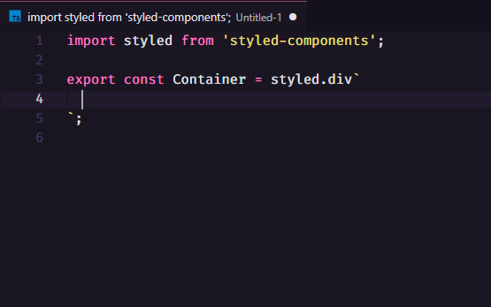

## VSCode Styled Components

Forked from [styled-components](https://github.com/styled-components/styled-components)

All features until the version 0.0.31(925c9b5)

### Changes:

- ~~typescript-styled-plugin removed~~
- ~~CSS autocompletion(snippets) with colon and semicolon added~~

- typescript-styled-plugin support
- auto add colon and semicolon improved



If you have any corrections or suggestions, open an issue.

# vscode-styled-components

Syntax highlighting and IntelliSense for [styled-components](https://github.com/styled-components/styled-components).


Uses a CSS grammar built on top of [language-sass](https://github.com/atom/language-sass) and [language-css](https://github.com/atom/language-css).

## Install

Inside VSCode, press `Ctrl+P`, and enter:

```
ext install diegolincoln.vscode-styled-components
```

It should be the top result.

[[Source](https://marketplace.visualstudio.com/items?itemName=diegolincoln.vscode-styled-components)]

## Features

- Syntax highlighting for styled components in JavaScript and TypeScript.
- Detailed CSS IntelliSense while working in styled strings.
- Syntax error reporting.

## Usage

The styled-components extension adds highlighting and IntelliSense for styled-component template strings in JavaScript and TypeScript. See [plugin configuration](https://github.com/Microsoft/typescript-styled-plugin#configuration) for information on configuring the linter and other language features.
